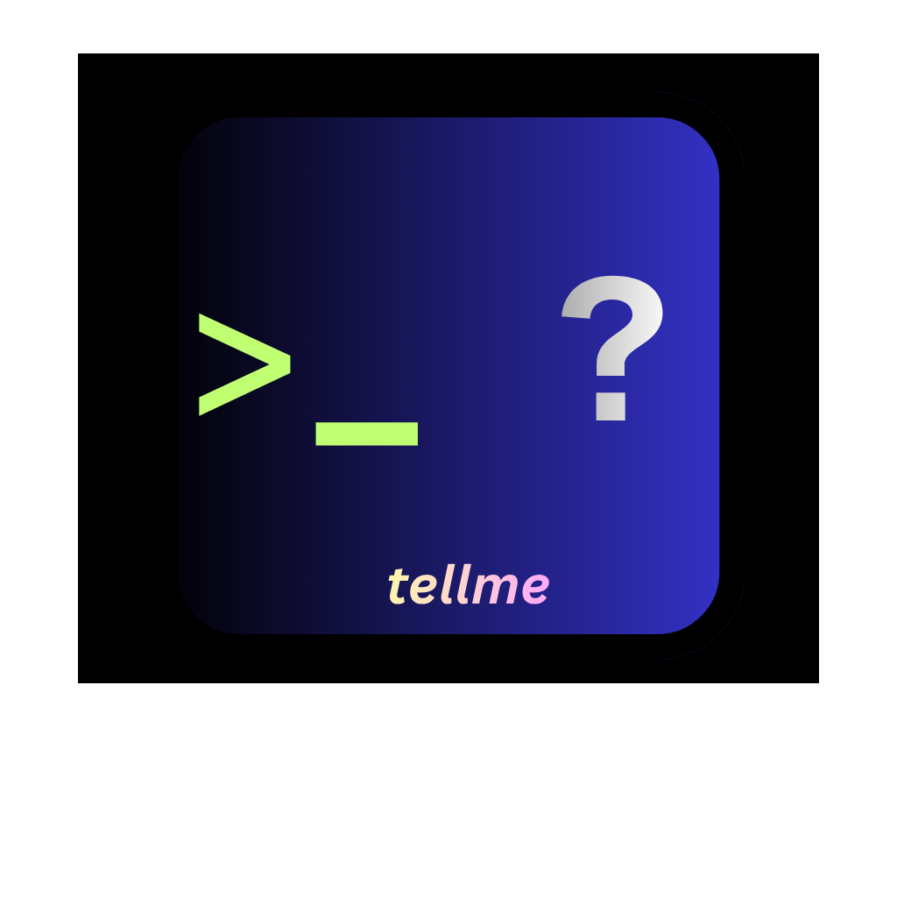

# tellme ⚡️

`tellme` is a lightning-fast, 100% offline developer tool inspector that answers questions about your local development environment.
**100% Offline. Zero Sudo. Instant Lookups.**

<p align="center">
  
</p>

## 📦 Get started

You can install `tellme` directly via Homebrew without manually tapping first:

```bash
brew install eaccmk/homebrew-tellme/tellme
```

> [!NOTE]
> _Once our formula is accepted into Homebrew Core, this command will become:_

```bash
brew install tellme
```


> see `tellme` in action


```bash
$ tellme "do I have python and java?"

📦 Python (Python 3.14.7) - Python Software Foundation
--------------------------------------------------
What    :  Interpreted high-level programming language
Where   :  /usr/local/Cellar/python@3.14/3.14.7/Frameworks/Python.framework/Versions/3.14/bin/python3.14
When    :  Installed/updated 2 hours ago (Aug 14, 2026)
How     :  Try running: `python3 main.py` or `python -m venv venv`
```

> limted emoji support 🐍 (raise a PR to ad more 🙏)

---

##  Key Features

- 100% Offline & Air-gapped: Never makes network requests. Your data stays on your machine.

- Zero Elevation: Never runs or asks for `sudo`, admin privileges, or passwords. Fails safely with clear messaging if permissions are restricted.

- O(1) Registry Lookup: Instantaneous performance powered by an in-memory map covering hundreds of system binaries, core developer utilities, top NPM packages, and Apple/iOS development tools (`xcodebuild`, `simctl`, `tuist`, etc.).

- Multi-Tool Concurrency: Query multiple tools in a single sentence (e.g., `tellme do I have docker and git?`) resolved concurrently via Go routines.

- Temporal Insight: Dynamically inspects file metadata to tell you when a binary was last installed or updated.

- Pipeline Safe: Automatically detects TTY output and strips colors/emojis when piped into other Unix commands (e.g., `tellme python | cat`).

---

### 📦 Installation (Via Homebrew)

Install the precompiled binary via our Homebrew tap:

```bash
brew tap eaccmk/tellme
brew install tellme
```

> [!TIP]
> **Zsh Globbing Notice:** Zsh interprets question marks (`?`) as globbing wildcards. To write queries like `tellme do I have python?` without quotes, add the following to your `~/.zshrc`:
> ```bash
> eval "$(tellme init)"
> ```

---

### Contributing (PRs Welcome!)

Want to add a missing tool to the O(1) registry? Check out our [CONTRIBUTING.md](CONTRIBUTING.md) guide to see how easy it is to add tools and submit a Pull Request.

---

### License
MIT
